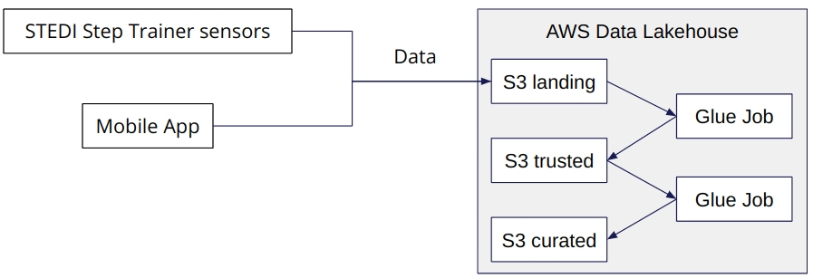
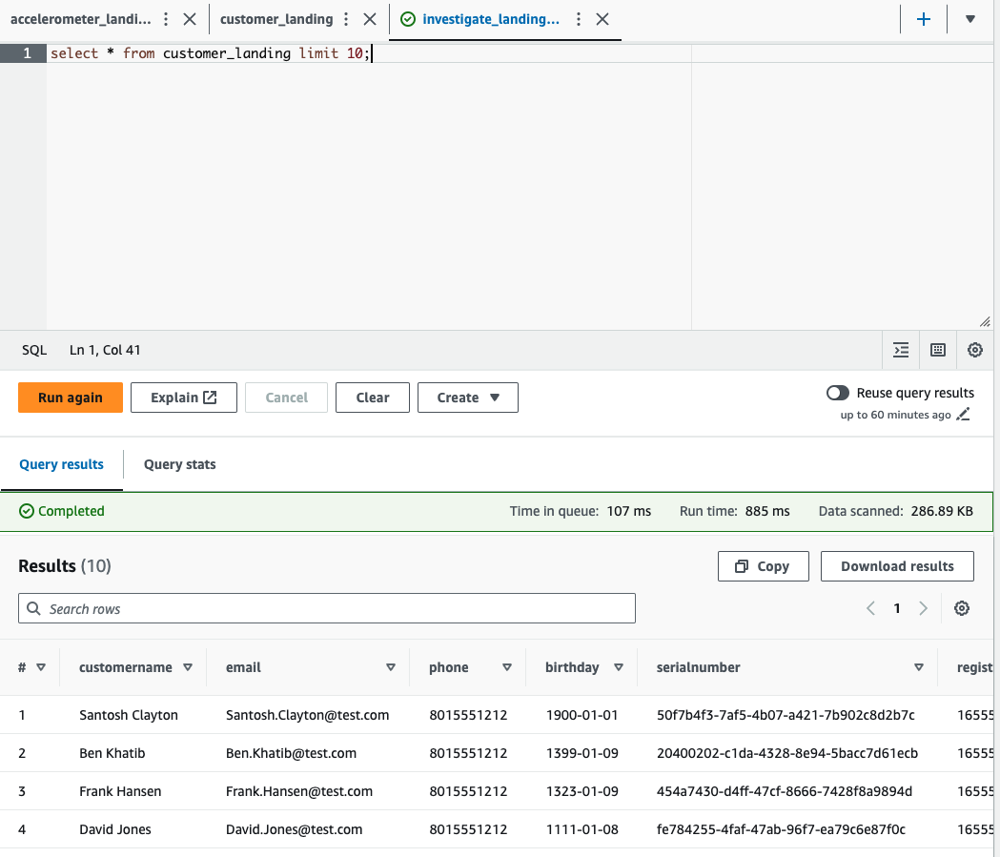
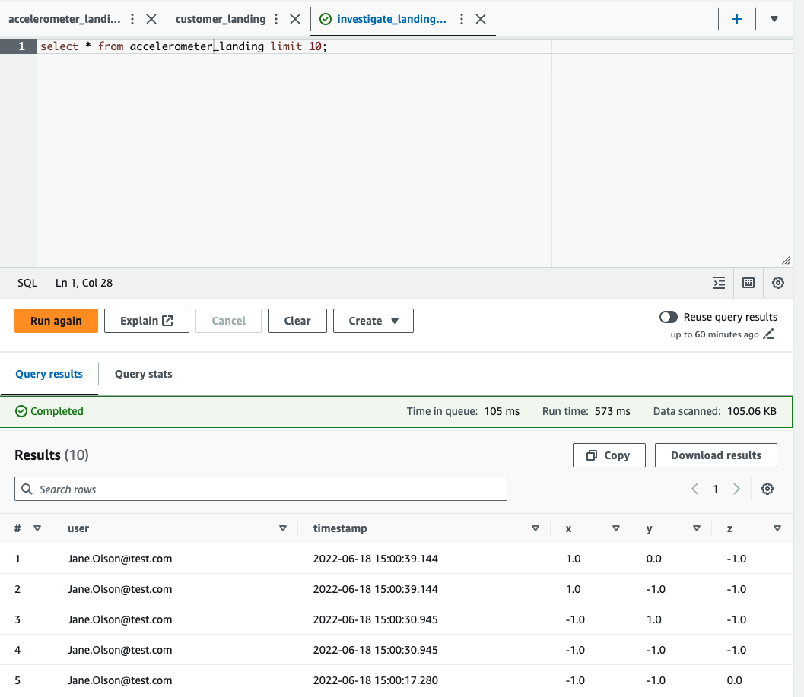
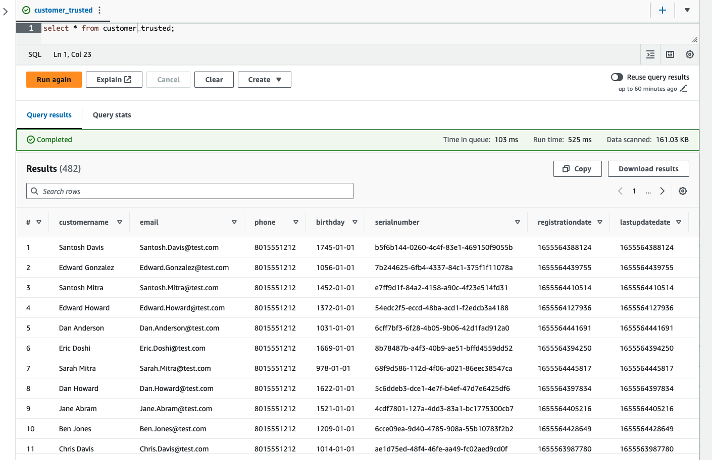

# DataStreaming
Repo for Project 3 in Udacity Data Engineering with AWS Nanodegree

  

## Background

### STEDI Human Balance Analytics

In this project, you'll act as a data engineer for the STEDI team to build a data lakehouse solution for sensor data that trains a machine learning model.

#### Project Details

The STEDI Team has been hard at work developing a hardware STEDI Step Trainer that:

- trains the user to do a STEDI balance exercise;
- has sensors on the device that collect data to train a machine-learning algorithm to detect steps;
- has a companion mobile app that collects customer data and interacts with the device sensors.

STEDI has heard from millions of early adopters who are willing to purchase the STEDI Step Trainers and use them.

Several customers have already received their Step Trainers, installed the mobile application, and begun using them together to test their balance. The Step Trainer is just a motion sensor that records the distance of the object detected. The app uses a mobile phone accelerometer to detect motion in the X, Y, and Z directions.

The STEDI team wants to use the motion sensor data to train a machine learning model to detect steps accurately in real-time. Privacy will be a primary consideration in deciding what data can be used.

Some of the early adopters have agreed to share their data for research purposes. **Only these customers' Step Trainer and accelerometer data should be used in the training data for the machine learning model.**

#### Project Summary
As a data engineer on the STEDI Step Trainer team, you'll need to extract the data produced by the STEDI Step Trainer sensors and the mobile app, and curate them into a data lakehouse solution on AWS so that Data Scientists can train the learning model.

## Data

### Landing Tables
1. `stedi.customer_landing` - 956 rows - This has all of the original customer data.

  

2. `stedi.accelerometer_landing` - 81,273 rows - This has all of the original accelerometer data.

  

3. `stedi.step_trainer_landing` - 28,680 rows - This has all of the original step trainer data.

### Trusted Tables
1. `stedi.customer_trusted` - 482 rows - This table is limited to only customers that have opted into research.

  

2. `stedi.accelerometer_trusted` - 40,981 rows - This table is limited to accelerometer readings for customers that opted into research.

3. `stedi.step_trainer_trusted` -  14,460 rows - This table is limited to step trainer readings for customers that opted into research.

###  Curated Tables
1. `stedi.customer_curated` - 482 rows - This table is limited to only customers that have opted in for research and have accelerometer readings available.

2. `machine_learning_curated` -  43,681 rows - This table has combined the accelerometer and step trainer readings for customers that have opted into research.